# 高雄市茄萣區介紹 (Intro. to Qieding District)

> 高雄市茄萣區過去是漁業發達的小村落，在冬令期間盛產的烏魚子遠近馳名。每隔數年，區內寺廟輪流舉辦的建醮及燒王船活動非常具有文化特色，每每吸引媒體爭相報導。但是因為地處偏遠，居民要接受比較好的教育及就業機會，必須就近到台南市或高雄市中心區，青壯年及教育水平高的人率先向外追求更好的機會。根據2018年底的人口統計資料，茄萣區人口第一次少於三萬人，人口外移的情況嚴重。根據2012年高雄市社會局資料，茄萣區男性低收入戶列冊的比例在高雄市各區中排名第五，女性排名第六。茄萣區除了擁有豐富的文化特色外，政府曾在茄萣區的興達港推動遠洋漁港計畫，計畫執行過程中導致周圍有半人為茄萣濕地的形成，吸引大批候鳥棲息，引起世人注目... 然後... 就沒有了... XD

> 在這個文件中，我們持續地將茄萣區的資訊彙整在這裡，用來幫助腦力激盪，看看資訊科技能不能用在對家鄉環境的改善上面。(大部分圖形取自網路，之後會慢慢將他修改掉。)

茄萣區現況摘要如下：

* 根據2018年底的人口統計資料，茄萣區人口第一次少於三萬人，人口外移的情況嚴重。
* 居民要接受比較好的教育及就業機會，必須就近到台南市或高雄市中心區，青壯年及教育水平高的人率先向外追求更好的機會。
* 茄萣區距離台南市中心區車程約 30 分鐘，距高雄市中心區車程約 50 分鐘，因為距離並不是非常遙遠，所以加速了人口往都市方向發展。
* 茄萣區沒有銀行設點，居民仰賴農漁會及郵局處理簡單金融業務。
* 茄萣區沒有知名的美食連鎖設點，譬如：沒有麥當勞。
* 過去曾經漁業興盛，但近年來漁源枯竭，多數漁民必須另謀生路。
* 根據2012年高雄市社會局資料，茄萣區男性低收入戶列冊的比例在高雄市各區中排名第五，女性排名第六。
* 根據海洋局的資料，2016年茄萣區漁戶人口數約占全區人口的 10%，在高雄市各區中的排名是第三。

底下我們針對茄萣區的幾個面向做說明：

* 地理位置
* 人口組成
* 文化
* 生態保育
* 觀光
* 過去及未來的大型政府計畫

## 1.1 茄萣區地理位置

茄萣位於高雄市海岸線的最北端，隔著二仁溪與台南市對望，最南端是興達港，港區的對岸是永安區，進出茄萣的主要道路是台17線濱海公路。茄萣區內有四所國小、一所國中、一所高職，國中之後要追求更高學位，通常需要通勤至台南唸書，再不然就是要離鄉背井搬到其他縣市，居民從小就習慣對外尋找發展機會。

<table>
<tr>
<td style="vertical-align: text-bottom;">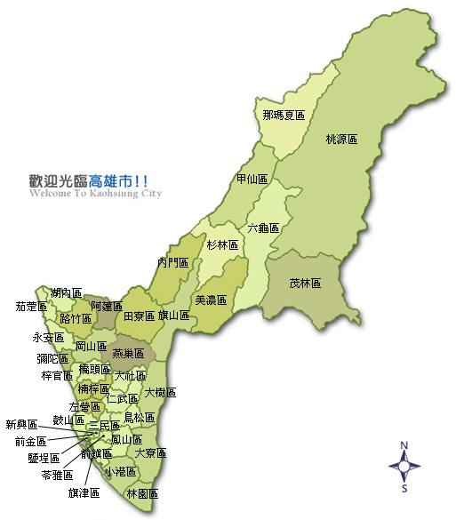</td>
<td style="vertical-align: text-bottom;">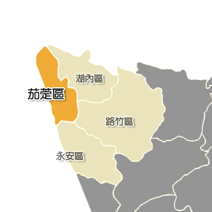</td>
</tr>
<tr>
<td style="text-align:center;">高雄市38行政區圖</td><td style="text-align:center;">茄萣區放大圖</td>
</tr>
</table>

<!-- 

 -->

茄萣區過去以漁業為主，區內工廠不多，商家多是提供基本民生需求的小吃或雜貨店，工作機會很少。如果不是要在家鄉自己開個小店，大致上都必須到外地尋找工作機會。除了工作機會之外，生活機能也是人口外移的原因之一。假日想要看場電影？到台南！想要買個桌球網？到台南的運動用品店！除了簡單的吃住，其他想做的，大致上都要開車到台南！向外尋求休閒娛樂，已經變成一種慣性。

## 1.2 茄萣人口組成

根據維基百科上的資料，除了特定幾年人口稍有增加外，茄萣人口一直在減少。對照戶政資料，茄萣的人口在2018年底來到歷史新低，總人口已經少於三萬人。

<table>
<tr>
<td>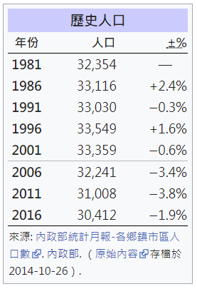</td>
</tr>
<tr>
<td style="text-align:center;">維基百科上的人口統計資料</td>
</tr>
</table>

<!--  -->

根據戶政資料2018年終教育水平統計，茄萣區15歲以上居民的教育水平分布如下圖所示，但是茄萣區的工作機會並沒有太多學士以上的需求。可以想見大部分學士以上的居民都到外地尋求發展，而留在家鄉的鄉親，教育水平以國中及高職居多。

<table>
<tr>
<td>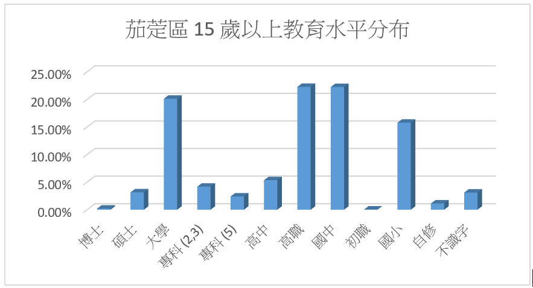</td>
</tr>
<tr>
<td style="text-align:center;">茄萣區15歲以上人口教育水平統計</td>
</tr>
</table>

<!--  -->

底下兩個表格是2012年高雄市社會局註冊的各區低收入戶比例。茄萣區男性低收入戶的比例在高雄市38個行政區中排名第五，女性排名第六。

<table>
<tr>
<td>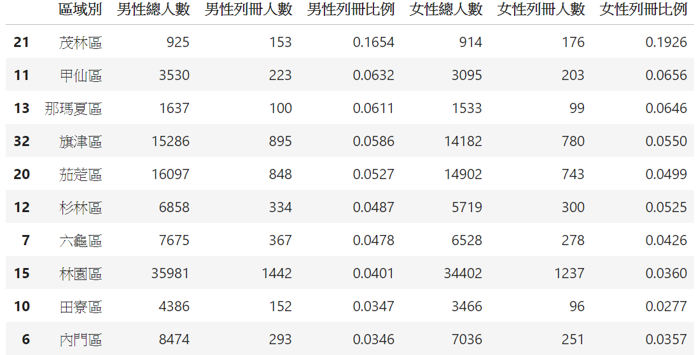</td>
</tr>
<tr>
<td style="text-align:center;">茄萣區低收入戶統計 (上表以男性列冊比例做排序)</td>
</tr>
</table>

<table>
<tr>
<td>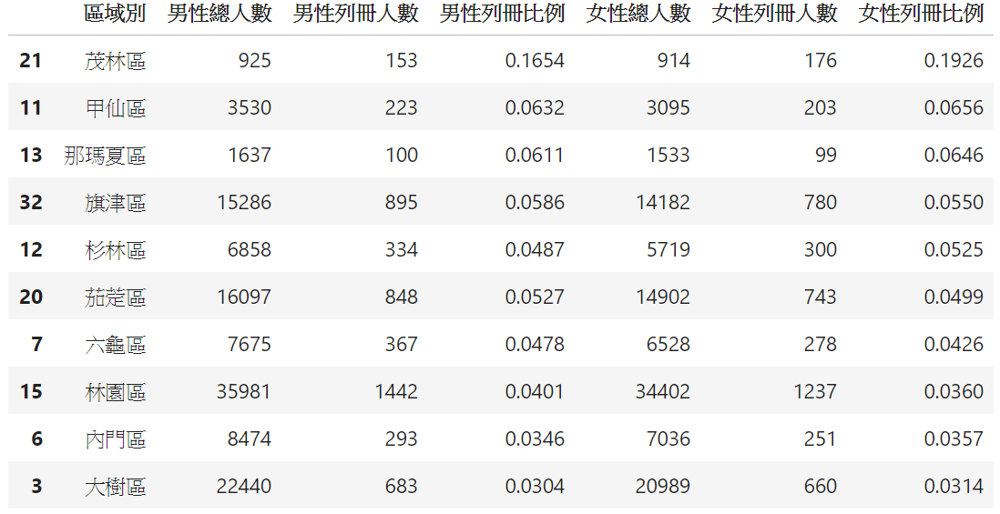</td>
</tr>
<tr>
<td style="text-align:center;">茄萣區低收入戶統計 (上表以女性列冊比例做排序)</td>
</tr>
</table>

<!--  -->
<!--  -->

底下的表格是高雄市海洋局民國 105 年漁戶人口數統計。茄萣區的漁戶人口數比例在高雄市 38 行政區中，排名第三。

<table>
<tr>
<td>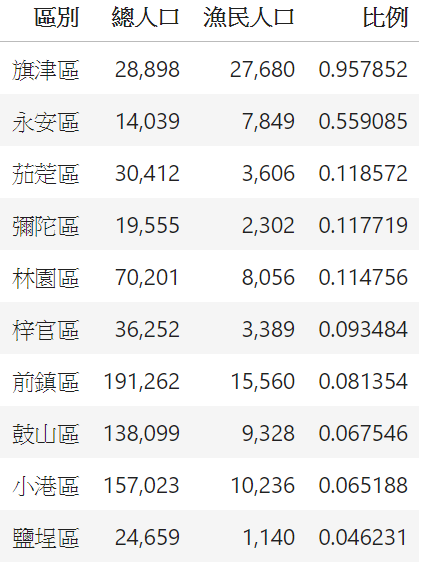</td>
</tr>
<tr>
<td style="text-align:center;">茄萣區漁戶人口統計</td>
</tr>
</table>

<!--  -->

茄萣地區人口外移，跟教育、生活機能和工作機會有很大的關係。

## 1.3 茄萣文化

茄萣歷史悠久，根據陳奕樑(2019)論文《茄萣地區北海王爺之研究》，“「茄萣」地名的由來，古稱堯港或蟯港，地名首見於明神宗萬曆30年(1603)陳第所著《東番記》：「東番夷人不知所自始，居澎湖外洋海島中，起魍港、加老灣、歷大員、堯港、打狗嶼、小淡水、雙口溪、加哩林、沙巴里、大幫坑，皆其居也。」”

“堯港確切的地理位置，根據清康熙24年(1685)杜臻《澎湖台灣紀略》的說明：「(台灣城)城之西皆大海，而沙線重複，舟不可近。城之南一沙埂，屬於內土，約萬丹港。湖之旁有港，東入曰蟯港；即陳第所謂堯港也。埂上置七崑身。崑身者，山阜之名。」… 所謂七鯤鯓乃指自台南安平，綿延向南至高雄茄萣白砂崙的一連串沙洲，而堯港就是在這一連串沙洲南端盡頭，處往內陸凹入的內海潟湖，時至今日興達港就是古堯港內海殘存水域。”

<table>
<tr>
<td style="vertical-align:top;">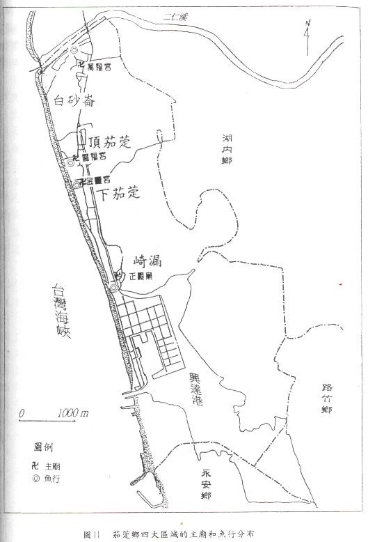</td>
<td style="vertical-align:top;">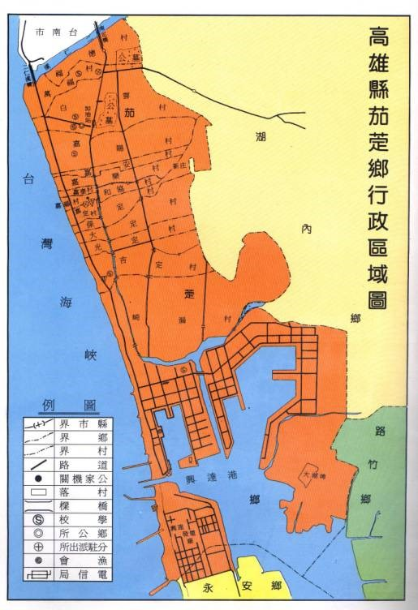</td>
</tr>
<tr>
<td style="text-align:center;">舊版地圖：上頭標出了四個主廟位置</td><td style="text-align:center;">區公所內的區域圖</td>
</tr>
</table>

因為茄萣自古以來皆是以漁業為主，衍生了許多關於茄萣漁民生活及漁業文化的研究，但是隨著近海漁源枯竭、海岸線萎縮，漁民人口數已經巨幅減少，現在的茄萣海邊已經跟小時候的記憶大不相同。過去沙灘上有許多，奔跑迅速的螃蟹，俗稱”沙尾仔”，現在已不常見；乖孫兒送飯給牽罟的阿公們，或是用三角櫓網撈魚、挑鰻苗的情景，也僅只留存在記憶當中。

除了漁業，茄萣的廟宇跟陣頭文化是我覺得非常有特色而逐漸要被淹滅在無情的歲月中的寶藏。從白砂崙至興達港，茄萣的海岸線約有 5.8 公里，狹長的茄萣區由北至南分成四個聚落 – 白砂崙、頂茄萣、下茄萣、崎漏，各個聚落有自己的庄頭廟，依序是萬福宮、賜福宮、金鑾宮、正順廟。各庄頭廟會有不定期醮典，與東港東隆宮每三年一次的王船祭不同的地方在於，醮典的舉行與否需要再問過神明的意見，而茄萣區的王船祭比之其他地方更慎重及盛大。

<table>
<tr>
<td></td>
</tr>
<tr>
<td style="text-align:center;">茄萣王船祭</td>
</tr>
</table>

<!--  -->

根據石乙正(2007) 論文《茄萣地區祭祀圈與武陣之研究》，”茄萣地區的武陣可說是單一鄉鎮密度最高的鄉鎮，29個武陣陣頭，絕不比內門的宋江少，且類型也可達六種，多樣化的武陣陣頭更比內門更勝一籌。”

而許雍正(2007)《茄萣藝陣之研究》認為，茄萣地區文陣武陣各自呈現變化多端的樣貌，”其內容之豐富、樣貌之多樣性，均居全國之冠”。

<table>
<tr>
<td>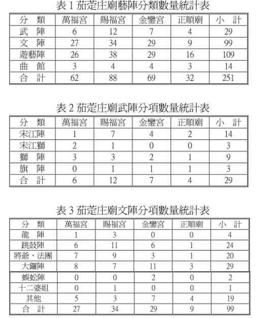</td>
</tr>
<tr>
<td style="text-align:center;">茄萣藝陣之考察</td>
</tr>
</table>

<!--  -->

在茄萣的文化中，有一塊很特別但是慢慢在消逝的角頭文化。在茄萣區的四個聚落有各自的庄頭廟，廟中的神明的神力覆蓋了各個聚落，每當有建醮的祭典活動時，各姓的家族會負責自己的陣頭表演。陣頭跟角頭文化後面暗藏著古早時代當官方的勢力無法將各個區域保護的面面俱到時，地方青年互助合作、自發性的保衛家園抵抗外侮的熱血跟責任。

在鄉下，婚宴喜慶的宴席常常是在路邊搭個棚子，熱熱鬧鬧和親友跟鄰居同樂。宴席過後，偶而都會看到棚子周遭各戶人家的阿姨們拿著掃把幫忙清掃。這種一損具損、一榮共榮的同甘共苦的文化，很讓人覺得窩心。

茄萣區不管是漁業、廟宇、陣頭等等的文化，都有非常迷人的獨特之處。但是要如何讓這些特色變成文創的重點，成為可以改善居民生活的文化特色，需要進一步的評估。

## 1.4 生態保育

茄萣區在生態保育上，最近比較常上媒體，也比較常聽到周遭鄉親提起。茄萣區是沿著海岸的狹長區域，北面以二仁溪與台南市為界，南端則是隔著興達港跟永安區對望。

二仁溪曾經是全台汙染最嚴重的溪流，但是近年來茄萣舢筏協會嘗試復育彈塗魚跟招潮蟹得到不錯的成果，連珍古德女士都曾慕名來訪。

<table>
<tr>
<td></td>
</tr>
<tr>
<td style="text-align:center;">白砂崙濕地彈塗魚復育</td>
</tr>
</table>

<!--  -->

而在興達港旁邊的茄萣濕地則是因為鳥種已經超過 140種，達到拉姆薩公約的國際及重要濕地的標準，而且每年都有黑面琵鷺到茄萣濕地過冬，所以獲得許多的關注。

<table>
<tr>
<td>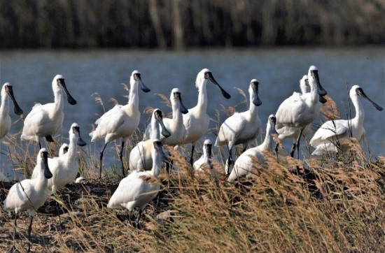</td>
</tr>
<tr>
<td style="text-align:center;">茄萣濕地黑面琵鷺</td>
</tr>
</table>

<!--  -->

茄萣濕地是半人為濕地，濕地形成的部分原因是興達港遠洋漁港計畫執行過程中的港口浚深淤泥堆積所造成。下圖為茄萣濕地的範圍，溼地中的1-1號道路為當初為了遊艇工業區所開設，它橫向的畫過濕地，截斷了濕地的水源供給。而1-4號道路為原先都市計畫規劃的道路，它往北通向茄萣區的公墓，可以為部分茄萣區居民節省約 90 秒鐘的車程。

<table>
<tr>
<td></td>
</tr>
<tr>
<td style="text-align:center;">茄萣濕地1-4號道路爭議</td>
</tr>
</table>

<!--  -->

## 1.5 觀光

除了生態旅遊之外，茄萣的觀光景點多圍繞在海邊，特別是興達港周圍的區域。很多人對茄萣的印象都是停留在魚源充足時期的興達港，興達港觀光漁市是過去最多人會造訪的地方，在漁獲量充足的時候，有很多人會從外地到興達港來買魚。

<table>
<tr>
<td>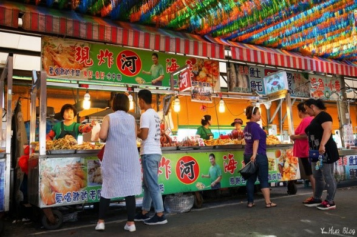</td>
</tr>
<tr>
<td style="text-align:center;">興達港觀光漁市</td>
</tr>
</table>

<!--  -->

我一直很喜歡家鄉海邊的夕陽，聽說堯港夕照曾被譽為滿清八景，但是故鄉的美常常都是自己人藏在心裡面的，似乎比較少人把這些美景資訊說與人知，所以網路上也比較少看到別人直接讚美茄萣的夕陽。

<table>
<tr>
<td></td>
</tr>
<tr>
<td style="text-align:center;">蟯港(古名堯港)夕陽</td>
</tr>
</table>

<!--  -->

隨著遠洋漁港計畫的不成功，興達港慢慢的被轉型成一個旅遊休憩的漁港。縣政府時期挹注了不少經費建造了情人碼頭，希望可以與北部的淡水漁人碼頭相互呼應。不過，目前人氣還是不太夠，需要更加努力推廣。

<table>
<tr>
<td>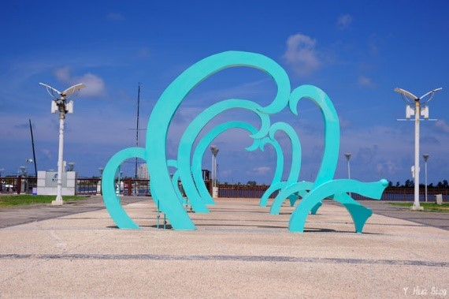</td>
</tr>
<tr>
<td style="text-align:center;">情人碼頭</td>
</tr>
</table>

<!--  -->

<table>
<tr>
<td>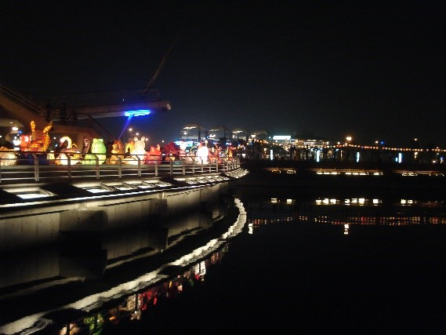</td>
</tr>
<tr>
<td style="text-align:center;">情人碼頭夜景</td>
</tr>
</table>

<!--  -->

在興達港附近還有一個因為李安電影「臥虎藏龍」而爆紅的「郭常喜藝術兵器文物館」。郭常喜先生是茄萣名人，除了「臥虎藏龍」中的青冥劍跟其他四百多件兵器是出自他的手之外，聽說金庸也曾請郭常喜先生幫忙打造他的小說上的兵器來把玩。

<table>
<tr>
<td>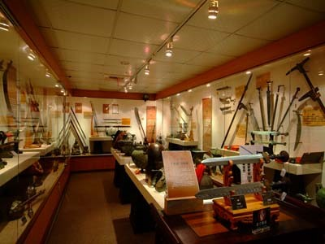</td>
</tr>
<tr>
<td style="text-align:center;">郭常喜兵器博物館</td>
</tr>
</table>

<!--  -->

本章節所提的觀光景點，都是大家比較常去的景點，大致上都圍繞在興達港附近，來觀光旅遊時，不用進入茄萣中心區，所以遊客也不會在中心區有太多消費。

## 1.6 過去及未來的大型政府計畫

政府曾經在茄萣區的興達港有過不少的投資，而這些投資反映了不同時期的國家整體規劃，而非單獨針對茄萣地區本身的規劃。

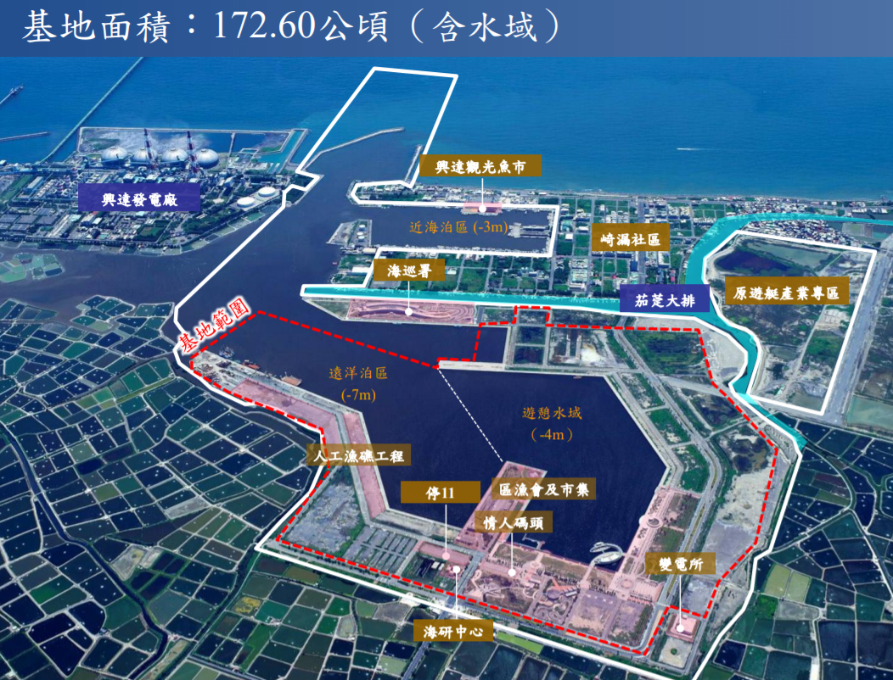

從最開始的興達港遠洋漁港計畫，政府投注了約七十幾億的資金，但是完工後並沒有太多漁船進駐，原先規劃的遊艇產業專區也沒有順利的被推動。後來，縣政府斥資十億建造了情人碼頭，想要將港區開發成觀光休憩的景點，不過目前人氣也有待提升。

興達港接下來的規劃，應該是進行「前瞻基礎建設計畫」中的離岸風力發電的建設的部分。關於這一部分的規劃，網路上有許多不同的聲音。目前看不出它對茄萣區居民的影響。

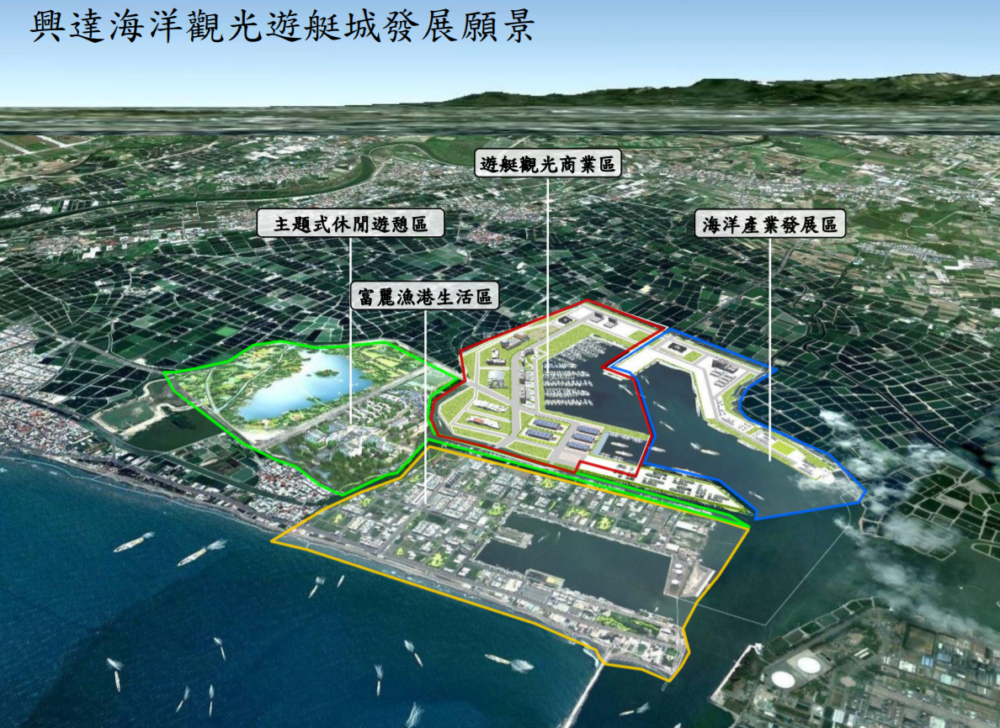

在茄萣區的發展上，過去跟未來的政府計畫看起來都沒有對茄萣區本身的發展有明顯的助益。

## 2. SWOT分析

我們將上面章節的重點摘要一下做成 SWOT 分析，方便做腦力激盪。

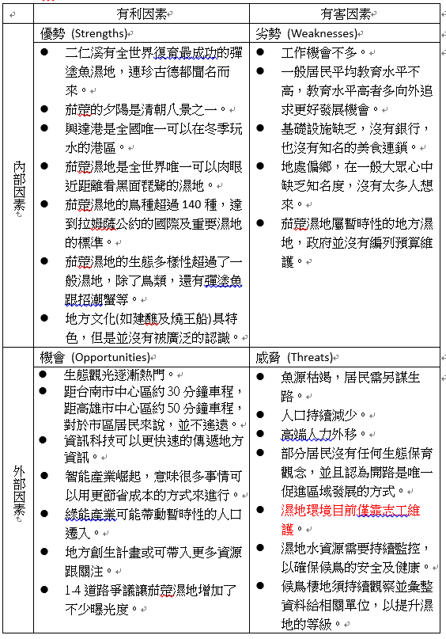

SWOT 策略分析：

根據 SWOT 分析的表格，我們可以針對茄萣區的優勢、劣勢、機會、跟威脅的排列組合，思考如何強化對地區發展的有利因素，並克服或減弱地區發展的有害因素，我們將腦力激盪的結果表列如下，並做進一步的說明。

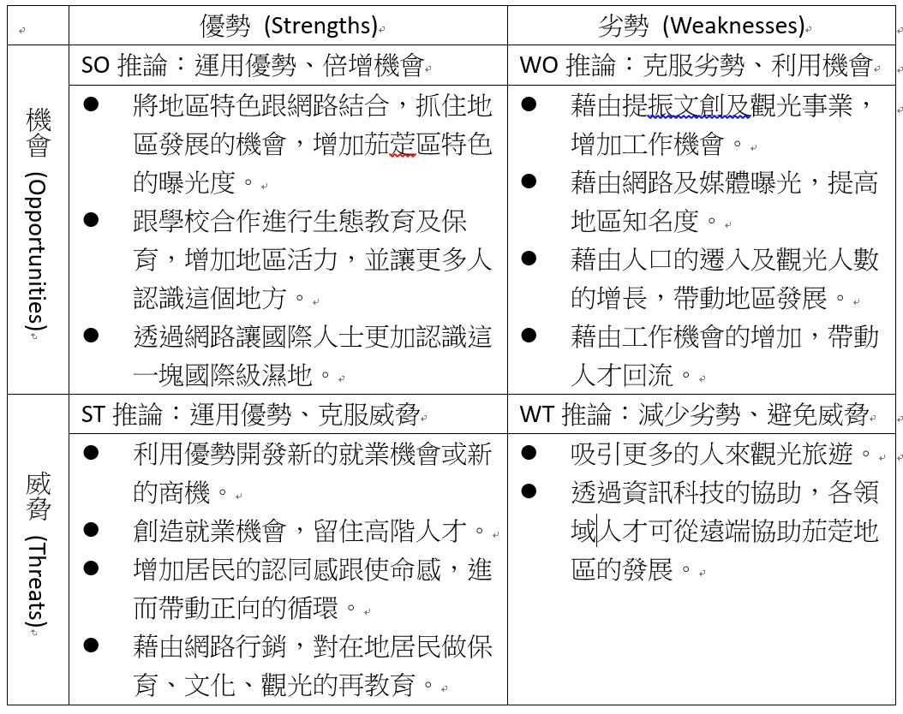

根據策略分析結果，我們要改善茄萣區的現況，可以嘗試底下的這些事情 (這些都是腦力激盪)。

* 整合並蒐集觀光資訊。

    茄萣區有許多生態旅遊的特色，分別有不同的協會自己推廣。如二仁溪生態復育，主要是茄萣舢筏協會，而且茄萣濕地，目前是茄萣觀光發展協會。遊客需要更完整跟整合性的旅遊資訊，包含行程推薦、行程規劃等等。在去年之前茄萣區是高雄市 38 個行政區中，唯一一個沒有提供遊客任何茄萣區介紹的觀光摺頁的行政區。這一點迫切需要改善。

* 利用遠端協作的方式，整合茄萣區的文化資產，產業化茄萣區的文化。
  
    如果在全國博碩士資料網上面查詢”茄萣”這個關鍵字，會發現有不少研究茄萣的漁業生活、宗教信仰、文化變遷、教育、觀光等等議題的論文。這一方面表示，茄萣區有許多值得研究的議題，另一方面表示，一些在外地的鄉親用不同的方式，在表達對家鄉的關注。
    
    這些研究跟努力應該被統整，應該要有一個協作平台，整合目前不在茄萣的鄉親對家鄉的深入研究，並嘗試產業化這些研究的結果，讓更多人了解茄萣的文化。

* Line 機器人 (提供智慧化的諮詢服務)。
  
    提供 Line 機器人服務，讓遊客只要掃瞄 QR Code 之後，就可以透過 Line 查詢周圍景點，讓遊客感受更便利的旅遊服務。

* 建立茄萣區的旅遊網站。
  
    將旅遊及文創的資訊，整合到一個專屬於茄萣區的旅遊平台，讓不同地區的人可以透過網路，更簡單的取得茄萣的資訊。

* 建構電商平台販賣地區特色紀念品及文創商品。
  
    當協作平台上彙整了足夠的文化創意後，我們可以協助鄉親們嘗試開發一些文創商品或有地區特色的紀念品等等，之後也可以規畫建立一個電商平台來販賣這些紀念品。此一電商平台，可以跟茄萣區的網站整合在一起成為一個多功能的網站。

## 參考資料

* [高雄市茄萣區戶政事務所人口統計](https://jiading-house.kcg.gov.tw/Content_List.aspx?n=BCEA7209DFA7969A)
* [高雄市茄萣區公所 – 茄萣之美](https://cieding.kcg.gov.tw/Content_List.aspx?n=07F38BAA3B3E4BE1)
* [高雄市茄萣區公所 – 機關學校](https://cieding.kcg.gov.tw/cp.aspx?n=D50533E66F5BE86C)
* [台灣濕地列表](https://zh.wikipedia.org/wiki/%E5%8F%B0%E7%81%A3%E6%BF%95%E5%9C%B0%E5%88%97%E8%A1%A8)
* [國家重要濕地保育計畫](http://wetland-tw.tcd.gov.tw/WetLandWeb/web-kid/index.php)
* [維基百科 – 茄萣區](https://zh.wikipedia.org/wiki/%E8%8C%84%E8%90%A3%E5%8D%80)
* [高雄市政府民政局-人口統計查詢 - 民國105年12月](https://cabu.kcg.gov.tw/Stat/StatRpts/StatRpt1.aspx)
* [高雄市政府開放資料 – 海洋局 – 漁戶及漁戶人口數年報](https://data.kcg.gov.tw/dataset/fisherman-population-data/resource/032d2676-3f59-4490-8250-3ee4f3a80fda)
* [高雄市低收入戶概況分析 (102年)](http://socbu.kcg.gov.tw/download_file.php?file_dir=wf_content_file&file_link=WFC_00595_7_20170628_8NsLR.pdf&url_file_name=%E9%AB%98%E9%9B%84%E5%B8%82%E4%BD%8E%E6%94%B6%E5%85%A5%E6%88%B6%E6%A6%82%E6%B3%81%E5%88%86%E6%9E%90%28102%E5%B9%B4%29.pdf)
* [高雄工業園區列表](https://blog.xuite.net/youhome7/blog/303879079-%E9%AB%98%E9%9B%84%E5%B7%A5%E6%A5%AD%E5%9C%92%E5%8D%80%E5%88%97%E8%A1%A8)
* [茄萣燒王船](https://blog.xuite.net/r4522219/twblog/137656234-%E8%8C%84%E8%90%A3%E7%87%92%E7%8E%8B%E8%88%B9)
* [茄萣1-4道路工程開闢 生態浩劫與經濟發展 兩難！](https://www.peopo.org/news/343107)
* [白砂崙濕地](https://sites.google.com/site/translationreport/bai-sha-lun-shi-de)
* [【高雄茄萣景點】興達港情人碼頭](http://whuy123.pixnet.net/blog/post/151409214-%E3%80%90%E9%AB%98%E9%9B%84%E8%8C%84%E8%90%A3%E6%99%AF%E9%BB%9E%E3%80%91%E8%88%88%E9%81%94%E6%B8%AF%E6%83%85%E4%BA%BA%E7%A2%BC%E9%A0%AD)
* [【高雄茄萣景點】興達港觀光漁市](http://whuy123.pixnet.net/blog/post/223302043-%E3%80%90%E9%AB%98%E9%9B%84%E8%8C%84%E8%90%A3%E6%99%AF%E9%BB%9E%E3%80%91%E8%88%88%E9%81%94%E6%B8%AF%E8%A7%80%E5%85%89%E6%BC%81%E5%B8%82)
* [捕魚漁具介紹](http://library.taiwanschoolnet.org/cyberfair2005/accks/method/d5401.htm)
* [文化資源地理資訊系統 – 賜福宮](http://crgis.rchss.sinica.edu.tw/temples/KaohsiungCity/chieding/121513-SFG)
* [台灣宗教文化遺產 – 茄萣金鑾宮王醮大典](https://www.taiwangods.com/html/cultural/3_0011.aspx?i=172)
* 陳奕樑，茄萣地區北海王爺信仰之研究，碩士論文，2019。
* [許雍正，茄萣藝陣之考察](http://custom.nutn.edu.tw/upload/resource/2010072714441824.pdf)
* 林宸儀，茄萣地區陣頭的文化涵構之研究，碩士論文，2017。
* [郭秋美，由漁寮景觀來探究茄萣鄉漁民的生活世界](http://teach.kssh.khc.edu.tw/teacherweb/history/data/qie-ding.htm)
* [台灣HI起來-茄萣王船祭-尬陣頭](https://www.youtube.com/watch?v=Mxik-nKo9Mw)
* [歷史的傷痛 – 二仁溪](https://ourisland.pts.org.tw/content/%E6%AD%B7%E5%8F%B2%E7%9A%84%E5%82%B7%E7%97%9B%E2%94%80%E4%BA%8C%E4%BB%81%E6%BA%AA)
* [高雄市茄萣舢筏協會](https://www.facebook.com/CiedingSamfar/)
* [郭常喜藝術兵器文物館](http://www.6989595.com/)
* [維基百科 – 郭常喜](https://zh.wikipedia.org/wiki/%E9%83%AD%E5%B8%B8%E5%96%9C)
* [茄萣-多變的海岸線](http://www1.geo.ntnu.edu.tw/~shensm/Course/CourseWork/TaiGeom_Stu/%E9%AB%98%E9%9B%84%E7%B8%A3%E8%8C%84%E8%90%A3%E9%84%89/index.htm)
* [黑面琵鷺或是開闢道路？——茄萣1－4號道路開發爭議](https://opinion.udn.com/opinion/story/9096/1931325)
* [看完了電影《角頭》系列，你真的知道什麼才是，真正的角頭文化嗎](https://kknews.cc/zh-tw/entertainment/a3lgayj.html)
* [全國博碩士論文查詢](https://ndltd.ncl.edu.tw/cgi-bin/gs32/gsweb.cgi/ccd=lsoTkQ/result#result)