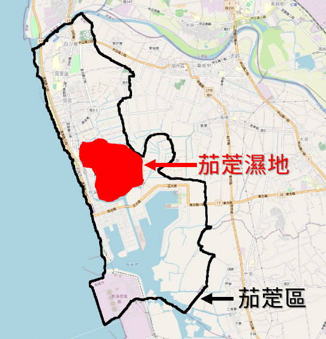
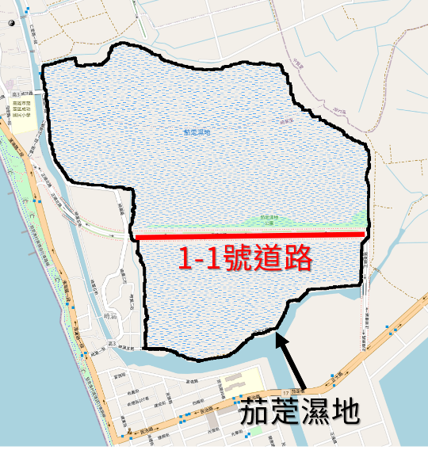
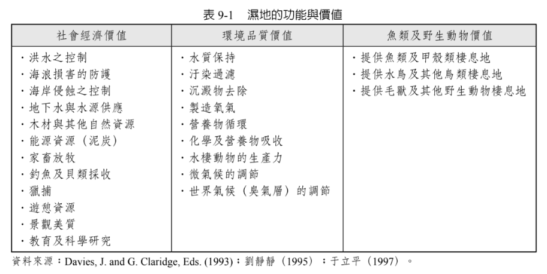
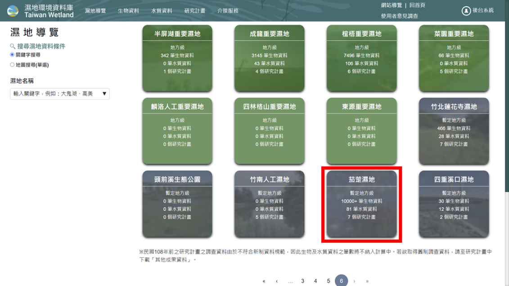
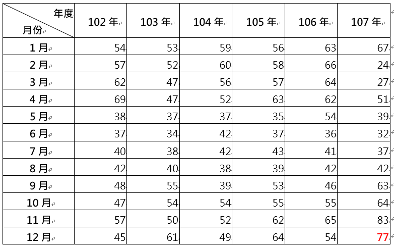
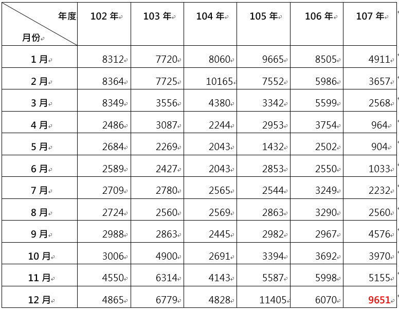
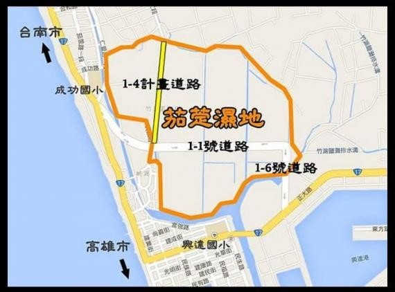

# 茄萣濕地

> 在這個文件裡面，我彙整了一些在網路上蒐集的資料，用來幫助我把茄萣濕地的問題想清楚，也讓我比較明確的知道資訊科技可能可以做些什麼事情來幫助這塊濕地。

> 在全國博碩士論文資料庫裡面查詢關鍵字"茄萣"，返回了476筆資料；而查詢"茄萣濕地"只返回了10筆資料。其中以"茄萣濕地"為研究主題的論文，只有一筆。那個... 大家不太給力啊... XD

## 關於茄萣濕地

高雄市茄萣濕地位在高雄市茄萣區的中心點，如圖一所示。茄萣濕地原先是竹滬鹽田北邊的部分，因為興達港的遠洋漁港計畫執行過程中，浚深港口的淤泥堆積在茄萣濕地處而慢慢形成一個半人工的溼地。茄萣濕地原名為竹滬鹽田濕地，在2007年時被政府指定為地方級重要濕地，於2012年被更名為茄萣濕地。2011年時，愛鳥人士發現茄萣濕地有 43 隻瀕臨絕種的黑面琵鷺棲息，造成轟動；自此，茄萣濕地內的黑面琵鷺數量逐年增加，已經有好幾年數量超過【拉姆薩國際濕地公約】的國際級濕地的水準。然而，因為在黑面琵鷺棲息之前，市政府對茄萣濕地的利用就已經有了一些規劃，所以不顧環保團體的抗議，在2012年時硬是完成了一條水平劃過茄萣濕地的1-1號道路，該道路切斷了濕地南邊的水源供給讓濕地的棲地維護變的更加困難。

<table>
<tr>
<td style="vertical-align: text-bottom;"></td>
<td style="vertical-align: text-bottom;"></td>
</tr>
<tr>
<td style="text-align:left;">圖一、上圖黑線標示的範圍為茄萣區，茄萣濕地位於茄萣區的中心點。</td><td style="text-align:left;">圖二、茄萣濕地放大圖。中間被1-1道路劃過，切斷了南邊的水源供給。</td>
</tr>
</table>

茄萣濕地內有不少稀有鳥種棲息，最引人注目的當然是瀕臨絕種的黑面琵鷺，國外媒體如國家地理雜誌、日本NHK、德國之聲都曾經來台報導這一塊黑面琵鷺棲息之地，環保團體跟愛鳥人士也會不定期地造訪茄萣濕地，觀察茄萣濕地的生態。除了國外媒體曾經報導茄萣濕地，國際鳥盟因為關注黑面琵鷺的生態，擔心茄萣濕地進一步被破壞，2014年時特別安排了兩位教授帶著學生從美國到茄萣濕地來做研究及調查。他們聯繫了濕地附近的環保團體，仔細地了解濕地的過去及現在，並與茄萣的居民舉辦了多場的工作坊，集思廣益的幫忙規劃濕地的未來，最後將調查結果寫成技術報告 [2]。而在國外的教授及學生們離開之後，茄萣濕地慢慢地恢復像是過去偏鄉的荒地一般，政府在維護上並沒有編列預算(目前僅編列一季一次的水質檢測及一年20次的鳥類調查等預算)，濕地的環境目前由茄萣觀光發展協會找志工幫忙維護。

濕地裡面除了有很多候鳥之外，濕地的存在對地方跟地球都有很多的好處 [3]，這些好處大部分居住在濕地旁的居民們都不知道。茄萣濕地為在茄萣區的中心點，滯洪池的作用非常地顯著，先前的多次風災造成了高雄市不少地災情，但是茄萣區卻因為有茄萣濕地的防洪功能，所以之前茄萣區最常淹水的崎漏里，近幾年來也很少聽到過去的淹水現象。除了防洪，濕地還有兩個非常重要但是大家可能比較無感的功能：淨水跟碳匯。濕地可以將水體的污染藉由濕地植物地吸收或細菌的分解等，讓汙染物沉澱，改善水質，也因此濕地有【地球之腎】的稱號。另外，部分的濕地植物可以吸收空氣中的二氧化碳並將之轉換成有機化合物，最後將原本在空氣中的二氧化碳固定匯集在土壤裡面，這樣的碳匯功能可以緩解全球暖化的效應。下表為濕地的功能與價值的彙整 [4]。

除了防洪、淨水、碳匯等功能，茄萣濕地最讓人熟知的就是它的生態功能。根據政府的溼地環境資料庫裡面的資料顯示，茄萣濕地目前 ”暫定” 為地方級濕地，而茄萣濕地登錄有 10000+ 筆生物資料，幾乎是所有濕地裡面物種數量最多的濕地。根據網站上的資料，台灣的濕地中只有三個濕地有 10000+ 筆生物資料，另外兩個濕地分別為龍鑾潭濕地及許厝港溼地，兩個都是國家級濕地 [5]。

<table>
<tr>
<td></td>
</tr>
<tr>
<td style="text-align:center;">圖三、上圖為政府濕地環境資料庫網頁上的溼地資料。</td>
</tr>
</table>

茄萣濕地每年有數以萬計的候鳥在此度冬，根據107年度茄萣濕地生態環境調查及巡守監測計畫中的數據顯示，每年4月到10月夏候鳥單月數量落在1000隻到3000隻上下，冬候鳥則從4000隻起跳，逐月增加到破萬的可觀數量，種類則從32-77數據呈現逐年增加趨勢。其中又以國際保育鳥種黑面琵鷺最受關注，根據營建署的監測數據統計最高紀錄達到400隻，數量接近全球的10分之一。

<table>
<tr>
<td style="text-align:left;">表一、102-107年度的候鳥數量統計</td>
</tr>
<tr>
<td></td>
</tr>
</table>

<table>
<tr>
<td style="text-align:left;">表二、102-107年度的候鳥鳥種統計</td>
</tr>
<tr>
<td></td>
</tr>
</table>

濕地對生態及環境都有很多好處，而茄萣濕地更是茄萣區發展跟轉型的契機。然而大部分民意代表卻是希望可以推動在濕地上開闢新道路，來促進茄萣區的發展，部分居民甚至明言，”人都活不下去了，有鳥有什麼用？”，這或許是東方文化的特色，炒地皮是大部分人認定的最快致富方式。不過，政府曾經耗資七十幾億推動興達港遠洋漁港計畫，但是計畫執行結束後，並沒有遠洋漁船停靠；為了遊艇工業區而開闢1-1號及1-6號道路，道路完成後遊艇工業也沒有繼續發展，而候鳥幾乎都不再到1-1號道路南邊的濕地棲息了，濕地北部的水源也因而被截斷；即便茄萣人口已經來到歷史新低，不少鄉親們依舊偏向相信垂直畫過濕地地1-4號開闢之後，茄萣區會重新繁榮 [6-9]。

<table>
<tr>
<td></td>
</tr>
<tr>
<td style="text-align:left;">圖四、茄萣濕地 1-4 號道路爭議。1-4號道路會畫過茄萣濕地，切斷水源供給，讓整個溼地更加破碎化。</td>
</tr>
</table>

茄萣濕地前幾年有非常多的媒體曝光度，一方面是環保團體認為濕地的鳥種的數量已經超越了國際級濕地的水平，不斷地促請政府提升濕地等級。另一方面是民意代表不斷地促請通過環評，以開闢一條新的1-4號道路劃過濕地，促進地區繁榮，但雙方對棲地的環境變化，都提不出有力的數據說服彼此，導致評定計畫被卡關 [10-14]。

由於茄萣濕地是地方級濕地，政府並沒有編列預算來維護茄萣濕地，目前濕地環境全靠志工維護。另外，由於濕地已經被1-1號道路切分成南北兩塊，濕地南邊的水源供給也因為1-1號道路的開闢而被截斷，所以濕地隨著季節乾旱的情況越來越嚴重。目前溼地水質採檢約一季進行一次，濕地水源的補給需出示水質檢驗報告並向養工處提出申請才可打開水閘門；志工們在感覺到水質可能有變化時，就要預先採水送檢，並檢具報告才能說服有關單位開啟水閘門 [15, 16]。

對於溼地的生態來說，水質的好壞是一件可能危及生命的事 [17-27]。水質汙染有可能會造成魚類、貝類的死亡，候鳥吃了死亡的魚類、貝類可能導致肉毒桿菌中毒，造成大規模的候鳥死亡。對於茄萣濕地這個擁有大規模候鳥棲息的濕地，濕地的水質監控更是不容忽視。除了水質的監測，候鳥的生態也需要持續的觀察，特別是確認候鳥的夜棲地是否在茄萣濕地內，因為這關乎候鳥是否覺得茄萣濕地是一個安全的棲息環境或是候鳥只是過境，我們的環境的保育是否健全或是我們的環境是否真的具備保育的價值。

對於濕地的研究，在全國博碩士論文資料庫上，查詢”濕地”這個關鍵字，約有476篇博碩士論文，而查詢了”茄萣濕地”則約有10篇論文，其中大約只有一篇論文是真的跟茄萣濕地的生態及環境的研究有關係。而從過去的經驗上，茄萣濕地在國外媒體跟國外學者的曝光率似乎比較能夠影響到茄萣濕地是否可以被重視及保存...

# 最後...

這些好像不應該是由我們說... 但是我們的確是這樣在做... XD

藉由整理上面的資料，我們在思考如何透過資訊科技改善濕地水質監控、生態保育、物種孵育、棲地營造等工作；並希望透過雲端跟國外媒體及學者接軌，藉由更多的國際曝光度落實生態保育、振興觀光，進而活化區域經濟，創造工作機會，留住高階人才，完全扭轉人口外移的現象，改善家鄉的生活；最後我們希望透過跟國際社會開放性的合作，可以讓大家更重視濕地保育在全球生態及環境議題上的重要性，並進一步的找出更好的緩解地球環境惡化的解決方案。

## 參考資料

1.	[茄萣區介紹](https://github.com/victorgau/Qieding/blob/master/intro.md)
2.	[技術報告 4.14: 1-4號道路暨茄萣濕地相關開發計畫之影響評估-茄萣經濟發展之策略計劃](https://savespoonbills.files.wordpress.com/2016/10/jiading_save-report-2014.pdf)
3.	[國家重要濕地保育計畫 – 濕地的功能](https://wetland-tw.tcd.gov.tw/edu/Features.php)
4.	邱文彥, 海洋與海岸管理, 五南出版社, 2017
5.	[濕地環境資料庫](https://wetland-db.tcd.gov.tw/#/wetlandGuidePage)
6.	[茄萣1-4道路工程開闢 生態浩劫與經濟發展 兩難！](https://www.peopo.org/news/343107)
7.	[來不及成為國寶？茄定濕地具有國際潛力 卻拿來當馬路？](https://www.newsmarket.com.tw/blog/87688/)
8.	[【茄萣濕地 美麗與哀愁】華視新聞雜誌 2016.09.30](https://www.youtube.com/watch?v=SGleCdiMZCI)
9.	[黑面琵鷺或是開闢道路？——茄萣1－4號道路開發爭議](https://opinion.udn.com/opinion/story/9096/1931325)
10.	[四千五百人陳情茄萣濕地是國際級濕地](https://www.cet-taiwan.org/node/2873)
11.	[護黑琵棲地 環團促茄萣濕地升格國家級](https://www.peopo.org/news/400527)
12.	[荒野保護協會 - 支持高雄茄萣溼地成為國際級溼地](https://www.sow.org.tw/blog/32/20161007/4991)
13.	[台灣城鄉發展脈動 – 高雄市茄萣濕地](https://formosarace.blogspot.com/2016/01/blog-post_21.html)
14.	[民間版茄萣暫定重要濕地分析報告書_推薦評定為國家級濕地.pdf](https://www.cet-taiwan.org/sites/cet-taiwan.org/files/%E9%99%84%E4%BB%B6%E4%B8%80%E3%80%81%E6%B0%91%E9%96%93%E7%89%88%E8%8C%84%E8%90%A3%E6%9A%AB%E5%AE%9A%E9%87%8D%E8%A6%81%E6%BF%95%E5%9C%B0%E5%88%86%E6%9E%90%E5%A0%B1%E5%91%8A%E6%9B%B8_%E6%8E%A8%E8%96%A6%E8%A9%95%E5%AE%9A%E7%82%BA%E5%9C%8B%E5%AE%B6%E7%B4%9A%E6%BF%95%E5%9C%B0.pdf)
15.	[國家重要濕地保育計畫](https://wetland-tw.tcd.gov.tw/tw/Ecology.php)
16.	[105年茄萣暫定重要濕地分析報告書 (草案)](https://wetland-tw.tcd.gov.tw/upload/file/20190606153958560.pdf)
17.	[高屏溪口的雁鴨輓歌 事隔四年再上演](https://e-info.org.tw/node/217010)
18.	[候鳥捎來的死亡訊息](https://ourisland.pts.org.tw/content/%E5%80%99%E9%B3%A5%E6%8D%8E%E4%BE%86%E7%9A%84%E6%AD%BB%E4%BA%A1%E8%A8%8A%E6%81%AF)
19.	[高屏溪肉毒桿菌事件 候鳥仍受威脅](https://video.udn.com/news/300970)
20.	[肉毒桿菌死千隻水鳥 高屏溪生態危機](https://www.epochtimes.com/b5/15/3/11/n4385274.htm)
21.	[水汙染致禽鳥集體中毒 鳥友憂候鳥仍受威脅](https://www.peoplenews.tw/news/8e94846c-6293-4a2d-9698-1b6c17382acf)
22.	[台南黑面琵鷺 感染肉毒桿菌](http://news.cts.com.tw/cts/general/200702/200702010215566.html)
23.	[華江雁鴨公園雁鴨死亡原因證實並非家禽流行性感冒，而是肉毒桿菌惹禍](https://xydo.gov.taipei/News_Content.aspx?n=C62C1AB644DD1222&sms=72544237BBE4C5F6&s=F25466D72B5E56C0&Create=1)
24.	[台南市政府農業局 – 黑面琵鷺](https://agron.tainan.gov.tw/cp.aspx?n=1240)
25.	[行政院農委會畜產試驗所 – 疫禽？又一黑琵暴斃](https://www.tlri.gov.tw/mobile/news_view.aspx?id=1636)
26.	[龍鑾潭水域發生優養化情形](https://np.cpami.gov.tw/youth/index.php?option=com_content&view=article&id=7326&Itemid=26)
27.	[維基百科 – 水質優養化](https://zh.wikipedia.org/wiki/%E5%AF%8C%E8%90%A5%E5%85%BB%E5%8C%96)

其他連結：(刪除重複連結中...)

* [內政部營建署 - 濕地保育法](https://www.cpami.gov.tw/%E6%9C%80%E6%96%B0%E6%B6%88%E6%81%AF/%E6%B3%95%E8%A6%8F%E5%85%AC%E5%91%8A/16504-%E6%BF%95%E5%9C%B0%E4%BF%9D%E8%82%B2%E6%B3%95.html)
* [台灣濕地網](https://wetland.e-info.org.tw/)
* [台灣濕地學會](http://www.wet.org.tw/)
* 為濕地注入活水, 科學人2014年4月號, p80。
* [林務局自然保育網](https://conservation.forest.gov.tw/)
* [98 西部海岸地區溼地生態園區規劃評估計畫.pdf](https://conservation.forest.gov.tw/File.aspx?fno=63439)
* [台灣濕地研究現況與未來發展 - 臺灣國家公園](file:///C:/Users/victor/Downloads/332_c58eef7a6d9faef5274919ac33ab8e8e.pdf)
* [eBird](https://ebird.org/home)
* [eBird - 高雄茄萣濕地](https://ebird.org/hotspot/L3409331)
* [高雄市野鳥協會](http://www.kwbs.org.tw/web/)
* [台灣濕地環境之永續管理](http://ir.nou.edu.tw/bitstream/987654321/817/3/B0903.pdf)
* [維基百科 – 茄萣濕地](https://zh.wikipedia.org/wiki/%E8%8C%84%E8%90%A3%E6%BF%95%E5%9C%B0)
* [高雄市政府工務局濕地廊道 – 茄萣濕地](https://pwbgis.kcg.gov.tw/wetland/WetLand.aspx?Cond=a009d492-b888-443e-8f22-27b00fafa83a)
* [台灣濕地網 – 茄萣濕地](https://wetland.e-info.org.tw/file/south/2330)
* [國家重要濕地保育計畫 – 茄萣濕地(暫定地方級)](https://wetland-tw.tcd.gov.tw/tw/GuideContent.php?ID=32&secureChk=f07088fb710f06654aa078cc8d3b313b)
